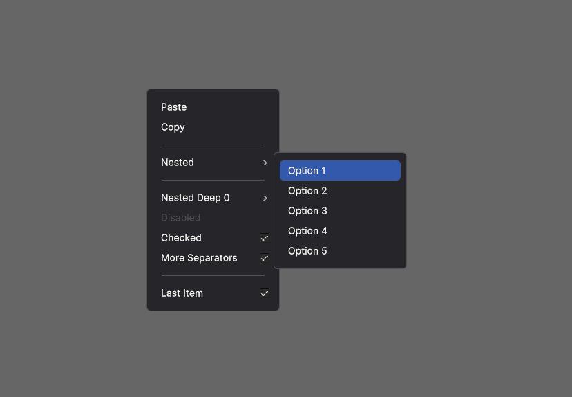

# Unity Runtime Contextual Menu


## Quick Start
```
// Import the contents of the "Plugins" folder into your project's "Plugins" folder.
// Write and add a MonoBehaviour to the same GameObject that has your UIDocument.
private void OnEnable()
{
    // Grab document
    UIDocument uiDocument = GetComponent<UIDocument>();

    // Add RUIContextualMenuManipulator to the top level element you want be able to right click
    uiDocument.rootVisualElement.AddManipulator(new RUIContextualMenuManipulator());

    // Grab the element that you want to right click 
    VisualElement elementWithMenu  = uiDocument
        .rootVisualElement
        .Q<VisualElement>(name: "element-with-menu");

    // Register a callback to populate the context menu
    elementWithMenu.RegisterCallback<ContextualMenuPopulateEvent>(PopulateMenuCallback);
}
...

private void PopulateMenuCallback(ContextualMenuPopulateEvent populateEvent)
{
    // This will be a single top-level option 
    populateEvent.menu.AppendAction("Option 1", NoOp, DropdownMenuAction.AlwaysEnabled);
    // This will add a separator
    populateEvent.menu.AppendSeparator();
    // This will be nested 
    populateEvent.menu.AppendAction($"Option 2/nested", NoOp, DropdownMenuAction.AlwaysEnabled);
    // This will add a separator, again
    populateEvent.menu.AppendSeparator();
    // This will be disabled
    populateEvent.menu.AppendAction($"Option 3", NoOp, DropdownMenuAction.AlwaysDisabled);
    // This will add a separator, again
    populateEvent.menu.AppendSeparator();
    // This will be checked
    populateEvent.menu.AppendAction($"Option 4", NoOp, action => DropdownMenuAction.Status.Checked);
}

private void NoOp() {}
```

## Custom Styling 
All default styling is contained under: `Plugins/RUI/ContextualMenu/Resources/RUI/RUIContextualMenu.uss`.  However, if you want to use your own StyleSheet, here's what you do:
```
// See the Quick Start example and change/add the following
private void OnEnable()
{
    ...
    // Construct an RUIContextualMenuManager and feed it your StyleSheet
    RUIContextualMenuManager manager = new(<YOUR STYLE SHEET>);
    
    // Pass the manager in to your MenuManipulator 
    uiDocument.rootVisualElement.AddManipulator(new RUIContextualMenuManipulator(manager));
    ...
}
```

## Submenu Behavior
When you hover your cursor over a menu item that has submenus, the submenus will open instantly.  If you then move your cursor outside of the menu item that opened the submenu, an invisible triangle will be created between your cursor and the new submenu.  This triangle represents a safe-zone for your cursor.  Even if it's hovering over a different menu item, the current submenu won't close.

But that safe zone only lasts for 0.3 seconds by default.  That delay is set in RUIContextualMenuBox as a constant called `SafeZoneTimeoutSecs`.  I'm hoping to make that customizable, but if you need to change the behavior immediately, that's where it is.